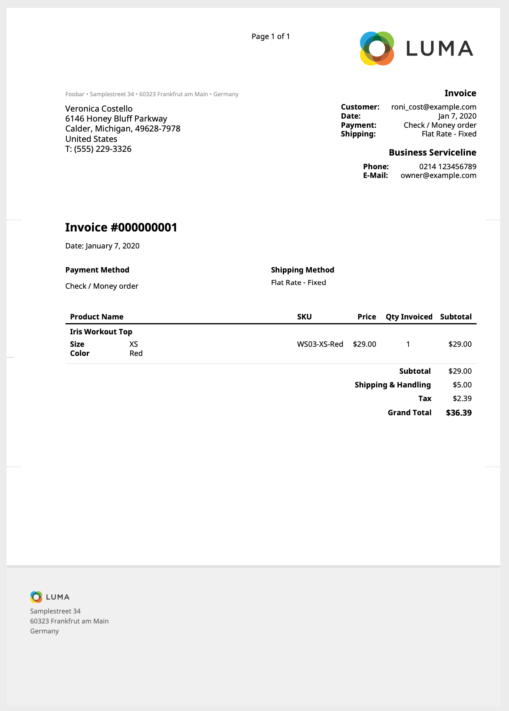

typeset.sh Magento 2 Extension
==============================

This Magento 2 extension provides an alternative PDF renderer using the
typeset.sh engine.

PDFs are generated using html provided by the store theme in the same maner as a
website is render (Using Blocks and phtml template files).
This makes adjusting the PDF easy if you are familiar with the Magento2 layout and theme structure.

This extension only replaces the `Magento\Sales\Model\Order\Pdf\*` classes.

Any adjustment to the PDF can then simply be done in your theme.

## Example


Adjustments to the PDF can be simple done in your theme folder.
Here is a [sample pdf ouptut file](docs/example-invoice.pdf).


## Installation via Composer

Get access to your typeset.sh repository. 
See the [typeset.sh documentation](https://typeset.sh/en/documentation/php).

 ```bash
 composer require typesetsh/magento2-extension
 php bin/magento module:enable Typesetsh_Pdf
 php bin/magento setup:upgrade
 ```


## License

This extension is under the [MIT license](LICENSE).

However, it requires a version of [typeset.sh](https://typeset.sh/) to work.
